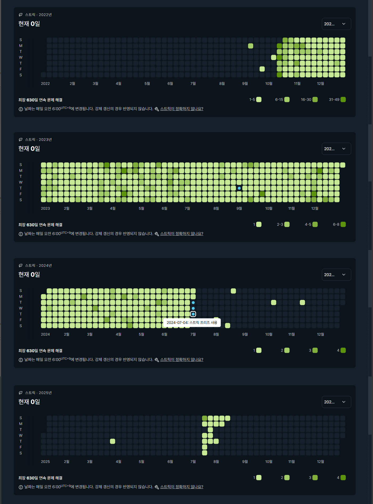

# boj-archive

백준 온라인저지 아카이브

소스코드는 [**BOJ-vault**](https://github.com/amsminn/boj-vault)
이미지는 [**BOJ-memory**](https://github.com/haruharo101/BOJ-memory)
를 사용하여 백업했습니다.

## 아래는 횡설수설 적는 코멘트입니다.

2022년 10월 10일을 시작으로 약 630일간 연속으로 문제를 풀었습니다.

처음에는 PS가 재밌어서 계속 하다 100일을 넘기다 보니,

오기가 생겨 매일 쉬운 문제라도 제출하며 스트릭을 채워나갔었네요.

24년 군입대 일자가 정해지고 살짝 아쉬운 감이 없지않아 있었습니다.

조금이라도 늦게 가면 스트릭을 더 채울 수 있을거라는 생각이 들었는데

그 당시에 제가 군대를 늦게 가는 편이어서 그냥 받아들였었죠.

입대 당일 부모님 차를 타고 훈련소로 가는 중에도

어제 풀어뒀던 문제를 제출해서 마지막 스트릭을 채웠었습니다.

이후 훈련소에 있을 동안은, 모아둔 스트릭 프리즈 3개가 자동으로 써군요.

이렇게 해서 총 630일을 채우게 되었는데,

약 1년 9개월이라는 군복무를 하다 보니.. 630일이라는 꾸준함이

정말 길었구나라고 생각이 되더라구요.

물론 사회와 군대의 시간은 다르다고는 하지만요...

전역 후 알고리즘 공부를 다시 시작해야 되나 고민하고 있었는데,

갑자기 백준이 서비스를 종료한다고 하니 기분이 참 묘하네요.

추억이라는 사진을 앨범에 넣을 때가 온 걸까요

---

